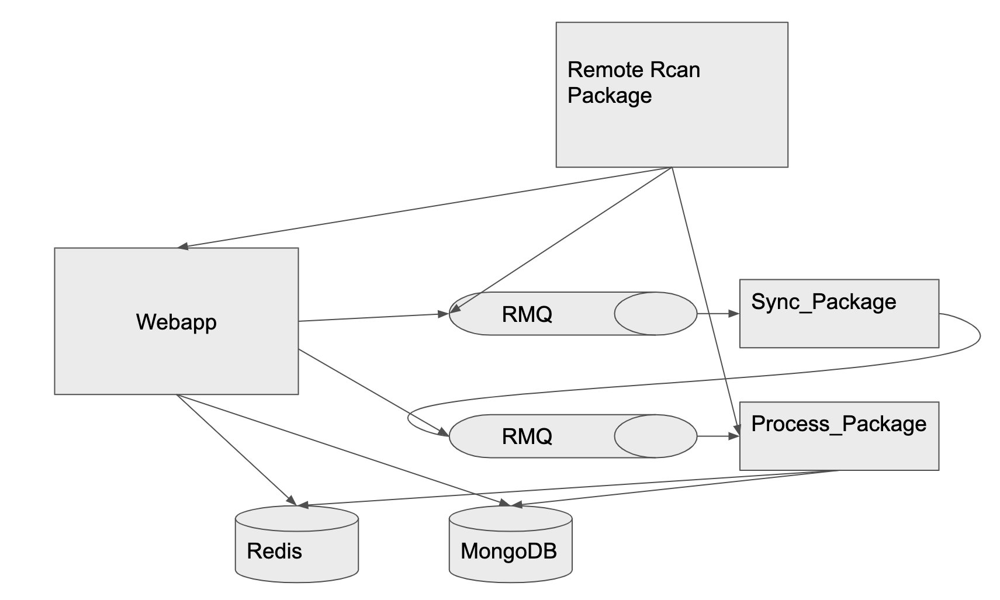

# cran-indexer


## To access the service

Currently the service is deployed to GCP, which could be accessed through

**http://35.240.177.243:8080/api/v0/**

## Quick Start

### Docker

```sh
docker network create backend
docker-compose up -d --build
```

After deploying to GCP, Create a firewall rule to allow traffic to your instance:

```sh
gcloud compute firewall-rules create default-allow-http-8080 \
    --allow tcp:8080 \
    --source-ranges 0.0.0.0/0 \
    --target-tags http-server \
    --description "Allow port 8080 access to http-server"
```

### Native

```sh
export APP_SETTINGS=webapp.config.DevelopmentConfig

# start consumer worker
celery worker -A celery_worker.celery -Q sync_package,process_package --loglevel=info
# start main applications
python manage.py run -h 0.0.0.0 
```

To debug in local, useful links:

- http://localhost:15672/
- http://0.0.0.0:5000/api/v0/


## Design Considerations



Overall `Flask` is used for the backend web framework. `flask_restplus` is used for exposing the RESTFUL api. `redis` is used for caching and `mongodb` as the database store. `Rabbitmq` is used for asynchronously processing the packages. 

### Consumer

1. Sync_package: which is used to parse the remote `PACKAGES` txt to get a full list of packages, and this list is used as the source to further process each individual package. This job could also be configured as cron job to make sure that service already in sync with the remote actual cran packages.
2. Process_Package: the consumer which takes the `package name` and `package version` and then perform the package process, which includes downloading the package by chunk, unzip and package to extract the `DESCRIPTION` text file, parsing the description file and update the `redis` and `mongodb` accrodingly. And this consumer is **idempotent** so that duplicates packages won't be processed/added to the DB.
 
### SQL or NoSQL

After some consideration based on the requirement given. I decided to go for NoSQL and chose the MongoDB as the database for the following reasons

1. For the given Package structure, the data is quite "self-contained". So instead of using the SQL to normalize the data into a many-to-many relationship (table `Package` and table `Person`), I use the de-normalized way to store each package as document in a collection `Package`
2. As based on the requirements, this web application should be a read heavy application, and the only query we need perform is query by the `Package Name` and no need to perform any search based on the person. That's why no need to de-normalize the data and use `JOIN` to return the while package information during query, which may create the a bit of overhead.
3. schema flexibility of the NoSQL gives us the freedom to add any new fields in the future.
4. Better support in regex search index. If using MySQL, when performing search by using `LIKE`, we could only search on `LIKE "XX%"`, but cannot perform `LIKE "%xx%"` as that will not utilize the index. However Mongo has better support on regex search which also utilize the indexing instead of performing full scan.